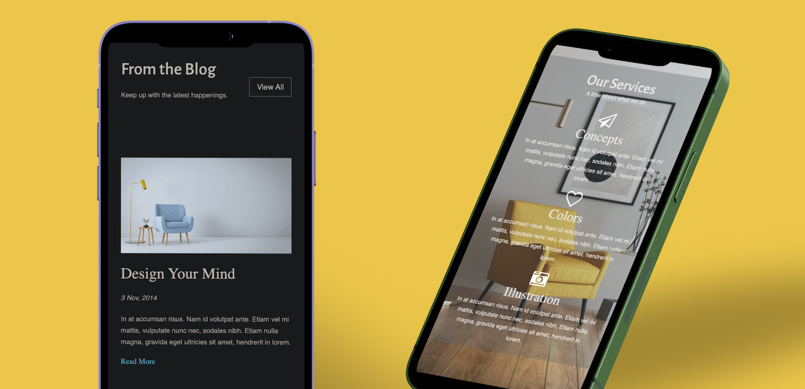

# The Media Queries Project
In diesem Projekt wird eine Frontend Website für eine Innenarchitektur-Agentur erstellt. Dabei wird besonders auf die Responsiveness Wert gelegt.

Mithilfe von Media Queries nach dem Mobile First Ansatz, kann die Website auf Smartphones, Tablets sowie Desktops dargestellt werden.

# Demo
https://the-media-queries-project.netlify.app/

# Author
- [@JohannaHaer](https://github.com/JohannaHaer)

# Screenshots
Landingpage: Ansicht Desktop

Websiteabschnitte: Ansicht Mobile

Kontaktformular (mit Parallax-Effekt): Ansicht Desktop

